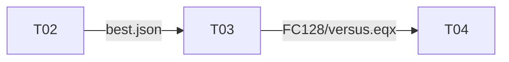

# Experiments

These notebooks produce the figures and tables of chapter 6 (*Experiments and Results*) of the report.
Each experiment has two notebooks:

- a **training** notebook in `training/`, which trains or evaluates agents and saves weights and metrics
  in `runs/<experiment>/`, and
- an **analysis** notebook in `analysis/`, which only reads `runs/` and saves figures (PDF) and LaTeX
  tables in `figures/`.

The notebooks share nothing except the files in `runs/`, so each one can be run on its own as long as
its input files exist.

## Contents

| Section | Topic | Training (writes `runs/`) | Analysis (writes `figures/`) |
|---|---|---|---|
| 6.1 | Manual fine tuning: entropy sweep on the crate stage | [T05](training/t05_a2c_entropy_sweep.ipynb) `a2c_entropy_sweep` | [A08](analysis/a08_a2c_entropy_sweep.ipynb) `a2c_entropy_sweep.pdf` |
| 6.2 | Hyperparameter search for FC128 (Kartal) and Conv1x1 (Skynet) | [T02](training/t02_a2c_hpo.ipynb) `a2c_hpo`, `a2c_hpo_1x1` | [A04](analysis/a04_a2c_hpo.ipynb) `a2c_hpo{,_1x1}_history.pdf`, `a2c_hpo{,_1x1}_sensitivity.pdf`, `a2c_hpo_best.tex` |
| 6.3 | 17×17 board: training progress with crate reward 0.6 and 0.3 | [T03](training/t03_a2c_17x17.ipynb) `a2c_17x17`, `a2c_17x17_03` | [A05](analysis/a05_a2c_17x17_progress.ipynb) `a2c_17x17_progress.pdf` |
| 6.3 | 17×17 board: failure modes and game outcomes | T03 | [A06](analysis/a06_a2c_17x17_difficulties.ipynb) `a2c_17x17_failure_modes.pdf`, `a2c_17x17_outcomes.pdf` |
| 6.4 | MCTS with the FC128 network: search budget, and a short self-play stage | [T04](training/t04_mcts.ipynb) `mcts` | [A07](analysis/a07_mcts_search_budget.ipynb) `mcts_search_budget.pdf`, `mcts_search_budget.tex`, `mcts_selfplay.pdf`, `mcts_selfplay.tex` |

## Order



T03 needs the best settings from T02, and T04 needs the network trained in T03. T05 does not depend on
anything. Run T02 once for each network by setting `NETWORK_NAME` to `"FC128"` or `"Conv1x1"`. The training
notebooks are meant to run on a GPU.

## Running

```bash
uv sync --extra notebooks       # or: pip install -e ".[notebooks]"
```

Open a notebook in Jupyter or VS Code. Paths are relative to the notebook's own folder, which both use as
the working directory by default. The number of iterations, parallel games, seeds and evaluation games are
set in the configuration cell of each notebook.

The metrics in `runs/` and all files in `figures/` are included in the repository, so the analysis notebooks
work without training anything. The only weights included are `runs/a2c_17x17/FC128/versus.eqx`, the final
A2C network, which T04 builds on.

## Good to know

- **Board size.** T02 and T05 train on a 9×9 board, T03 and T04 on 17×17. The size of the networks'
  fully connected layers depends on the board, so weights cannot be moved between board sizes. The
  hyperparameters can, except that T03 doubles the crate reward from 0.3 to 0.6.
- **Entropy sweep (T05).** One agent is trained on the coin stage. Then 21 short crate-stage runs start from
  its weights with the same random key. They differ only in $c_H$, which is constant within a run and lies
  between $10^{-1}$ and $5\cdot10^{-4}$. A08 draws one line per run, coloured by $c_H$.
- **Curriculum stages.** Each A2C training notebook has one function per stage: `collect`, `crates` and
  `versus`. A stage function sets up the board and reward and continues training the agent it is given,
  e.g. `agent, history, info = crates(agent, key, iterations=..., num_envs=...)`. Keyword arguments such as
  `learning_rate`, `entropy` or `pbrs=False` change the defaults. T02 calls these same functions inside its
  Optuna objective. It searches the learning rate of every stage and one entropy coefficient $c_H$, which
  every stage starts with and which decays to $5\cdot10^{-4}$. A trial is stopped early if the agent collects
  less than half of the coins after `collect` or `crates`.
- **MCTS (T04).** `AlphaZeroAgent` uses T03's FC128 network to guide its search. It scores the tree with the
  reward of T03's last stage, which is the reward the critic learned to predict. With `num_simulations=0`
  it plays the network directly, i.e. it is the A2C agent. A short AlphaZero self-play stage then fine-tunes a
  copy of the network, and both networks are evaluated the same way.
- **Evaluation.** Our agent plays 1 vs. 1 against the rule-based agent and always takes its best action.
  The board has crate density 0.35, 9 coins and 200 steps. The score is the game score (1 per coin, 5 per
  kill). A self-kill is a death in the agent's own explosion.
- **Pass coefficients as floats.** The defaults of `gamma`, `entropy_coef` and `entropy_final` in
  `Objective` are JAX arrays, and `Training` would update them like network weights. The notebooks
  therefore always pass Python floats.
- **Figures** are drawn at the report's text width (16 cm) with 9 pt text, so include them without scaling,
  e.g. `\includegraphics{../experiments/figures/a2c_17x17_progress.pdf}`, and include tables with
  `\input{...}`. If LaTeX is installed, it typesets the text in the figures; otherwise matplotlib uses its
  Computer Modern font.
- **Weights** are saved with `eqx.tree_serialise_leaves`. To load them, build a network of the same class
  with `for_settings` for the same board and pass it to `eqx.tree_deserialise_leaves` (see T04 or
  `bomberman/trained.py`).
